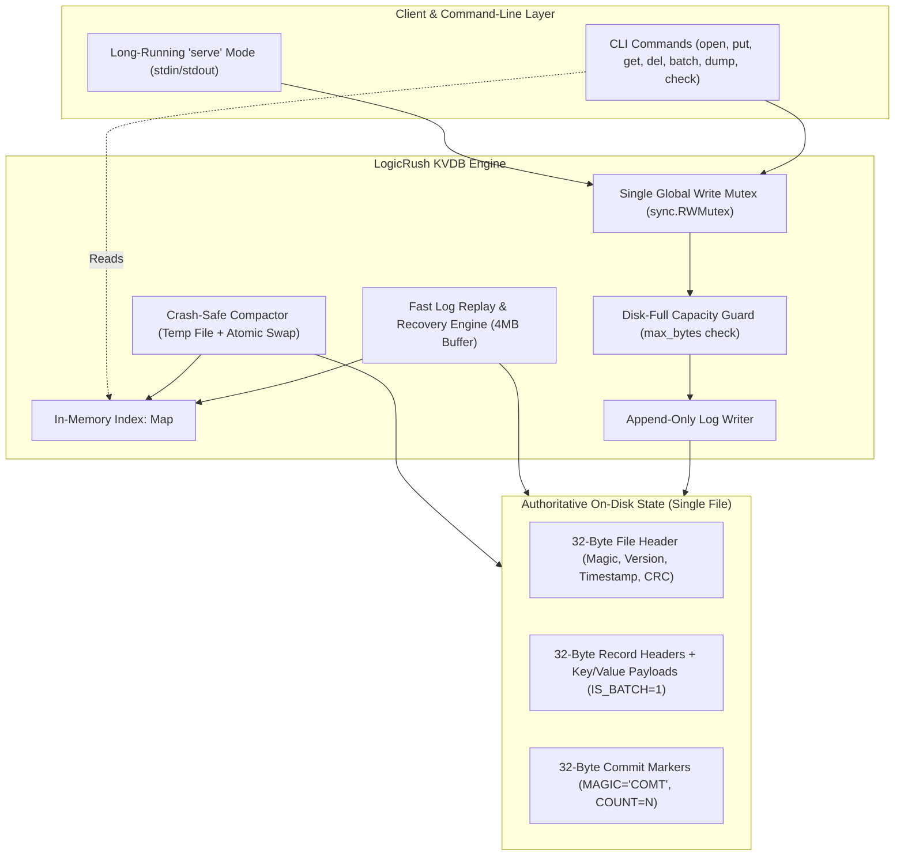

# Database Architecture Diagram Source

```mermaid
flowchart TD
    subgraph ClientLayer["Client & Command-Line Layer"]
        CLI["CLI Commands (open, put, get, del, batch, dump, check)"]
        ServeMode["Long-Running 'serve' Mode (stdin/stdout)"]
    end

    subgraph EngineCore["LogicRush KVDB Engine"]
        GlobalLock["Single Global Write Mutex (sync.RWMutex)"]
        DiskGuard["Disk-Full Capacity Guard (max_bytes check)"]
        MemIndex["In-Memory Index: Map<Key, (Offset, Len)>"]
        LogWriter["Append-Only Log Writer"]
        Recovery["Fast Log Replay & Recovery Engine (4MB Buffer)"]
        Compactor["Crash-Safe Compactor (Temp File + Atomic Swap)"]
    end

    subgraph DiskStorage["Authoritative On-Disk State (Single File)"]
        FileHeader["32-Byte File Header (Magic, Version, Timestamp, CRC)"]
        RecordPayloads["32-Byte Record Headers + Key/Value Payloads (IS_BATCH=1)"]
        CommitMarkers["32-Byte Commit Markers (MAGIC='COMT', COUNT=N)"]
    end

    CLI --> GlobalLock
    ServeMode --> GlobalLock
    GlobalLock --> DiskGuard
    DiskGuard --> LogWriter
    LogWriter --> DiskStorage
    Recovery --> DiskStorage
    Recovery --> MemIndex
    Compactor --> DiskStorage
    Compactor --> MemIndex
    CLI -. Reads .-> MemIndex
```
